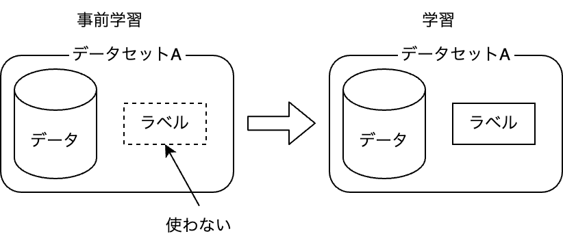
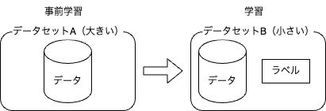
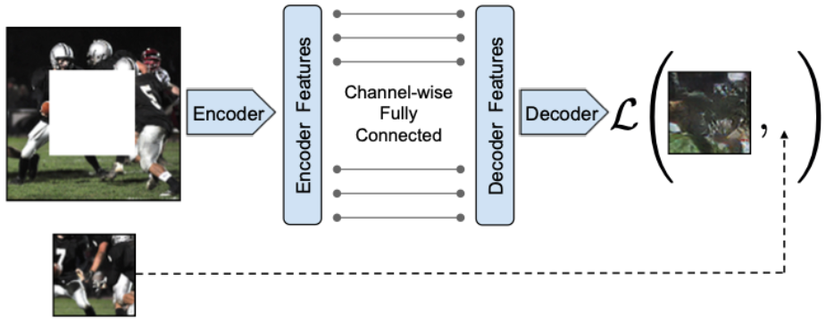
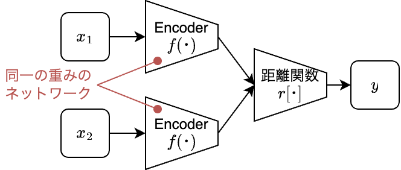
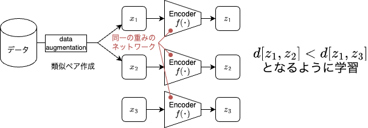
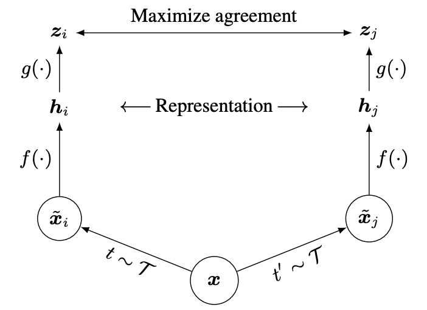
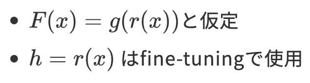
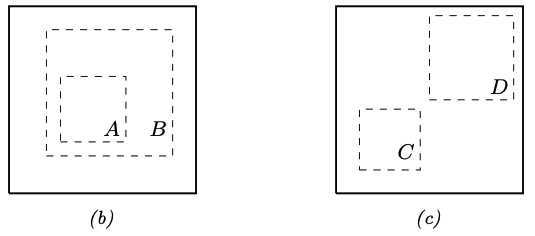
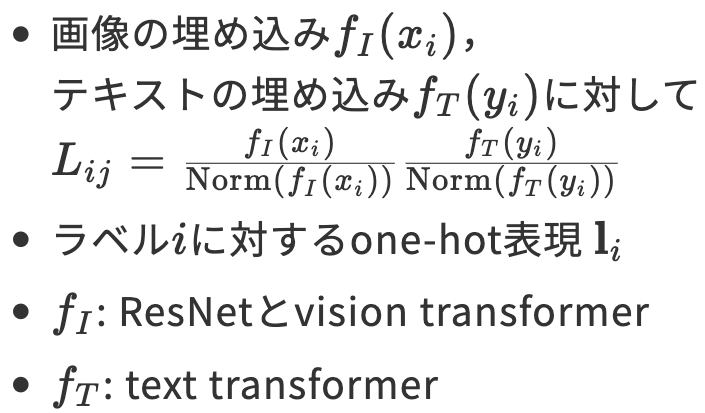
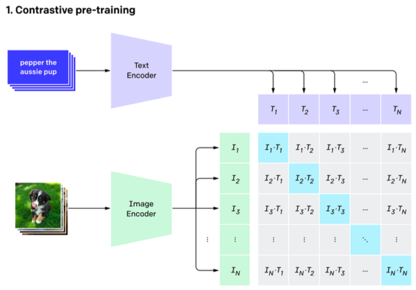

<!-- _class: lead -->

# 輪講
# Probabilistic Machine Learning
# 19.2.4 – 19.3 (19.3.6除く)

 

**澤田 桂都**
戸田研究室 M2
2024/11/08

---

<!-- _header: 目次(1) -->

19 Learning with Fewer Labeled Examples
- 19.1 Data augmentation
    - 19.1.1 Examples
    - 19.1.2 Theoretical justification
- 19.2 Transfer learning
    - 19.2.1 Fine-tuning
    - 19.2.2 Adapters
    - 19.2.3 Supervised pre-training
    - 19.2.4 Unsupervised pre-training (self-supervised learning)
    - 19.2.5 Domain adaptation

---

<!-- _header: 目次(2) -->

- 19.3 Semi-supervised learning
    - 19.3.1 Self-training and pseudo-labeling
    - 19.3.2 Entropy minimization
    - 19.3.3 Co-training
    - 19.3.4 Label propagation on graphs
    - 19.3.5 Consistency regularization
    - 19.3.6 Deep generative models
    - 19.3.7 Combining self-supervised and semi-supervised learning

---

<!-- header: 19.2.4 Unsupervised pre-training (self-supervised learning) -->
# 教師なし事前学習
<figure>

</figure>
同一のラベル付きデータセットを使った事前学習が一般的 (2000年代)

- 事前学習: ラベルを使わずに教師なし学習
- 本番の学習: ラベルを使って教師あり学習

---

# 自己教師あり事前学習
<figure>

</figure>

- 事前学習: 大きなラベルなしデータセットで事前学習
- 本番の学習: 小さなラベル付きデータセットでfine-tuning

→ 主要な3つの枠組みについて紹介（19.2.4.1 - 19.2.4.3）

---
<!-- header: 19.2.4.1 Imputation tasks -->

- 入力$x$を$x=(x_h, x_v)$に分割
- モデルが$x_v$から$x_h$を推測するように学習
    - 定式化: $\hat{x}_h = f(x_v, x_h = 0)$

NLP分野では「穴埋めタスク」として知られる
<figure>

    <figcaption>Figure 19.4 (a) 画像タスクでのContext-encoderに対する適用</figcaption>

</figure>

---
<!-- header: 19.2.4.2 Proxy tasks の前に… -->

# Siamese Network <!--読み方: シャムネットワーク-->

- 2つの入力$x_1, x_2$に対して同一のネットワークを使って特徴量を抽出
- 特徴量感の距離から$x_1, x_2$が同じクラスに属するかどうかを判定
    - 距離関数にはニューラルネットワークを使うこともある

<figure>

    
    <figcaption>Siamese Networkの構造</figcaption>

</figure>

---
<!-- header: 19.2.4.2 Proxy tasks (pretext tasks) -->

- 入力のペア$(x_1, x_2)$を作成
    - 例: $x_2$は$x_1$に回転処理を加えたもの ($x_2 = t(x_1)$)
- Siamese Networkに両者を入力して得た出力 $y$ で事前学習
    - $p(y|r[f(x_1), f(x_2)])$
    - 例: $y$が回転角度になるように学習

<figure>

    
    <figcaption>Siamese Networkの構造（再掲）</figcaption>

</figure>

---
<!-- header: 19.2.4.3 Contrastive tasks -->
- data augmentation (19.1)によって意味が似たデータペアを作成
- 埋め込み空間での両者の距離が，無関係なペアより近くなるよう学習

<figure>

    

</figure>

※ Deep Metric Learning (16.2.2) との違い
- DMLでは，外部から与えられる類似度ラベルを使う
- Contrastive tasksでは，ラベルなしデータから類似したペアを作成

---
<!-- header: 19.2.4.4 SimCLR (Contrastive tasksの例1) -->
SimCLR: **Sim**ple **C**ontrastive **L**earning of visual **R**epresentations
転移学習と半教師あり学習でSoTAを達成

- $x_1=t_1(x), x_2=t_2(x)$ をデータ$x$から作成
    - これらは意味的に等価な，xの "view"
    - 例: 画像の回転，切り抜きなど
- $x$と意味的に異なる "negative" サンプル $x_1^-,...,x_n^- \in N(x)$ を
データセットからサンプリング
- $F: \mathbb{R}^D→\mathbb{R}^E$を，$x$に対する類似度を基準に学習
    - $D$: 入力データの次元，$E$: 埋め込み空間の次元

---
- 類似するviewの類似度を最大化&異なるviewの類似度を最小化
$J= F(t_1(x))^TF(t_2(x))−\mathrm{log} \sum_{x_i^- \in N(x)} \mathrm{exp}[F(x_i^- )^TF(t_1(x))]$
(19.7)

※ [元論文](https://arxiv.org/pdf/2002.05709)に上式の記載がなく，出元や意図が不明

<!-- キーワード：sa, sb, fw -->

 

    <figure>
    

        
        <figcaption>Figure 19.5 (a)</figcaption>
    

    </figure>
 

 

 <figure>
    
    <!-- htmlタグ内では数式が無効化されるため，苦肉の策で画像にした… -->
 </figure>
 

---

解釈: 条件付きのエネルギーベースモデル（energy based model: EBM）
- $p(x_2|x_1)=\frac{\mathrm{exp}[- \epsilon(x_2|x_1) ]}{Z(x_1)}$ (19.8)
    - $\epsilon(x_2|x_1) = -F(x_2)^TF(x_1)$: エネルギー関数
    - $Z(x)=\int\mathrm{exp}[- \epsilon(x^-|x)]dx^-=\int\mathrm{exp}[F(x^-)^TF(x)]dx^-$
        :正則化定数（統計力学における分配関数） ← (19.8) 分子の積分
- $\mathrm{log}(p(x_2|x_1))=F(x_2)^TF(x_1)-\mathrm{log}\int\mathrm{exp}[F(x^-)^TF(x)]dx^-$
    - (19.8)の対数尤度を取ると，(19.7)と同じ形になる
    - $F(t_1(x))^TF(t_2(x))−\mathrm{log} \sum_{x_i^- \in N(x)} \mathrm{exp}[F(x_i^- )^TF(t_1(x))]$ (19.7)
    - 積分を"negative"サンプルから得られるモンテカルロ上界で置換
    - → Contrastive Learningは条件付きエネルギーベース生成モデルの
    最尤推定と解釈可能

---

# SimCLR の鍵
random cropによるdata augmentation
- (b)全体像から局所的な箇所の推定
- (c)画像の隣り合った部分の推定
- トリミング後に同じサイズになるようにリサイズ
<figure>
    

        
        <figcaption>Figure19.5 (b), (c)</figcaption>
    

</figure>

---
<!-- header: 19.2.4.5 CLIP (Contrastive tasksの例2) -->

CLIP: **C**ontrastive **L**anguage-**I**mage **P**re-training
web上のテキスト$x_i$-画像$y_i$のペア40億個を使った表現学習

ポイント:
- $y_i$に対応するテキスト$x_i$の正確な推定は困難
- ある画像$y_i$に対して，$x_i, x_j$のどちらが適するかの判定は比較的容易
- あるテキスト$x_i$に対して，$y_i, y_j$のどちらが適するかの判定も容易

---

損失関数

$J=\frac{1}{2}[\sum_{i=1}^N \mathrm{CE}(\mathbf{L}_{i,:},\mathbf{l}_i)+\sum_{j=1}^N \mathrm{CE}(\mathbf{L}_{:,j},\mathbf{l}_j)]$

<!--
- 画像の埋め込み$f_I(x_i)$，
テキストの埋め込み$f_T(y_i)$に対して
$L_{ij}=\frac{f_I(x_i)}{\mathrm{Norm}(f_I(x_i))}\frac{f_T(y_i)}{\mathrm{Norm}(f_T(y_i))}$
- ラベル$i$に対するone-hot表現 $\mathbf{l}_i$
- $f_I$: ResNetとvision transformer
- $f_T$: text transformer
-->

<!-- キーワード：sa, sb, fw. flex_cssの呼び出しが必要 -->
<!-- https://briboo-pc.hatenablog.jp/entry/2023/11/05/%E3%80%90Marp%E3%80%91%E3%82%B3%E3%83%94%E3%83%9A%E3%81%A7%E7%B0%A1%E5%8D%98%EF%BC%81%E5%A4%9A%E6%AE%B5%E7%B5%84%E3%81%BF%E3%82%B7%E3%83%B3%E3%83%97%E3%83%AB%E3%83%AC%E3%82%A4%E3%82%A2%E3%82%A6 -->

 

<figure>
    

        
    

</figure>

 

 

<figure>
    

        
        <figcaption>Figure 19.7 (a)</figcaption>
    

</figure>

 

---

