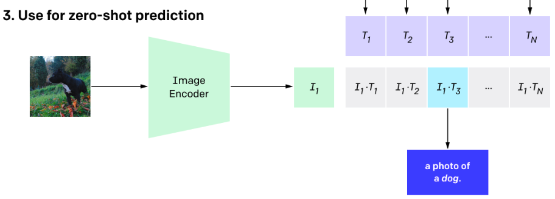
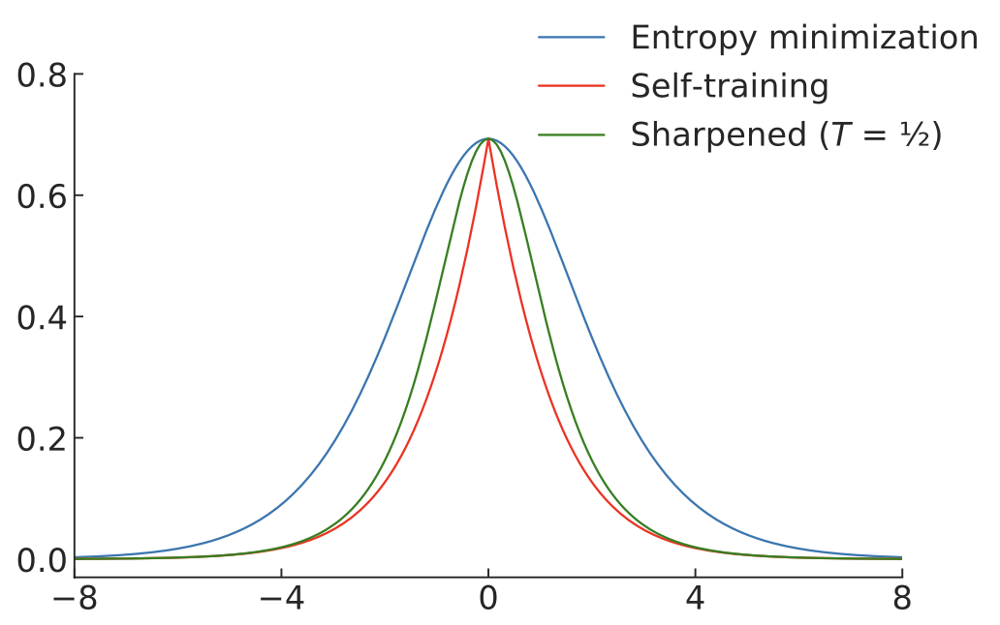

<!-- _class: lead -->

# 輪講
# Probabilistic Machine Learning
# 19.2.4 – 19.3 (19.3.6除く)

 

**澤田 桂都**
戸田研究室 M2
2024/11/08

---

<!-- _header: 目次(1) -->

19 Learning with Fewer Labeled Examples
- 19.1 Data augmentation
    - 19.1.1 Examples
    - 19.1.2 Theoretical justification
- 19.2 Transfer learning
    - 19.2.1 Fine-tuning
    - 19.2.2 Adapters
    - 19.2.3 Supervised pre-training
    - 19.2.4 Unsupervised pre-training (self-supervised learning)
    - 19.2.5 Domain adaptation

---

<!-- _header: 目次(2) -->

- 19.3 Semi-supervised learning
    - 19.3.1 Self-training and pseudo-labeling
    - 19.3.2 Entropy minimization
    - 19.3.3 Co-training
    - 19.3.4 Label propagation on graphs
    - 19.3.5 Consistency regularization
    - 19.3.6 Deep generative models
    - 19.3.7 Combining self-supervised and semi-supervised learning

---

<!-- header: 19.2.4 Unsupervised pre-training (self-supervised learning) -->
**教師なし事前学習**
<figure>

</figure>
同一のラベル付きデータセットを使った事前学習が一般的 (2000年代)

- 事前学習: ラベルを使わずに教師なし学習
- 本番の学習: ラベルを使って教師あり学習

---

**自己教師あり事前学習**
<figure>

</figure>

- 事前学習: 大きなラベルなしデータセットで事前学習
- 本番の学習: 小さなラベル付きデータセットでfine-tuning

→ 主要な3つの枠組みについて紹介（19.2.4.1 - 19.2.4.3）

---
<!-- header: 19.2.4.1 Imputation tasks -->

1. 入力$x$を$x=(x_h, x_v)$に分割
2. モデルが$x_v$から$x_h$を推測するように学習
    - 定式化: $\hat{x}_h = f(x_v, x_h = 0)$

NLP分野では「穴埋めタスク」として知られる
<figure>

    <figcaption>Figure 19.4 (a) 画像タスクでのContext-encoderに対する適用</figcaption>

</figure>

---
<!-- header: 19.2.4.2 Proxy tasks の前に… -->

**Siamese Network** <!--読み方: シャムネットワーク-->

1. 2つの入力$x_1, x_2$に対して同一のネットワークを使って特徴量を抽出
2. 特徴量感の距離から$x_1, x_2$が同じクラスに属するかどうかを判定
    - 距離関数にはニューラルネットワークを使うこともある

<figure>

    
    <figcaption>Siamese Networkの構造</figcaption>

</figure>

---
<!-- header: 19.2.4.2 Proxy tasks (pretext tasks) -->

1. 入力のペア$(x_1, x_2)$を作成
    - 例: $x_2$は$x_1$に回転処理を加えたもの ($x_2 = t(x_1)$)
2. Siamese Networkに両者を入力して得た出力 $y$ で事前学習
    - $p(y|r[f(x_1), f(x_2)])$
    - 例: $y$が回転角度になるように学習

<figure>

    
    <figcaption>Siamese Networkの構造（再掲）</figcaption>

</figure>

---
<!-- header: 19.2.4.3 Contrastive tasks -->
- data augmentation (19.1)によって意味が似たデータペアを作成
- 埋め込み空間での両者の距離が，無関係なペアより近くなるよう学習

<figure>

    

</figure>

※ Deep Metric Learning (16.2.2) との違い
- DMLでは，外部から与えられる類似度ラベルを使う
- Contrastive tasksでは，ラベルなしデータから類似したペアを作成

---
<!-- header: 19.2.4.4 SimCLR (Contrastive tasksの例1) -->
SimCLR: **Sim**ple **C**ontrastive **L**earning of visual **R**epresentations
転移学習と半教師あり学習でSoTAを達成

1. $x_1=t_1(x), x_2=t_2(x)$ をデータ$x$から作成
    - これらは意味的に等価な，xの "view"
    - 例: 画像の回転，切り抜きなど
2. $x$と意味的に異なる "negative" サンプル $x_1^-,...,x_n^- \in N(x)$ を
データセットからサンプリング
3. $F: \mathbb{R}^D→\mathbb{R}^E$を，$x$に対する類似度を基準に学習
    - $D$: 入力データの次元，$E$: 埋め込み空間の次元

---
- 類似するviewの類似度を最大化&異なるviewの類似度を最小化
$J= F(t_1(x))^TF(t_2(x))−\mathrm{log} \sum_{x_i^- \in N(x)} \mathrm{exp}[F(x_i^- )^TF(t_1(x))]$
(19.7)

※ [元論文](https://arxiv.org/pdf/2002.05709)に上式の記載がなく，出元や意図が不明

<!-- キーワード：sa, sb, fw -->

 

    <figure>
    

        
        <figcaption>Figure 19.5 (a)</figcaption>
    

    </figure>
 

 

 <figure>
    
    <!-- htmlタグ内では数式が無効化されるため，苦肉の策で画像にした… -->
 </figure>
 

---

**条件付きのエネルギーベースモデル（energy based model: EBM）**
- $p(x_2|x_1)=\frac{\mathrm{exp}[- \epsilon(x_2|x_1) ]}{Z(x_1)}$ (19.8)
    - $\epsilon(x_2|x_1) = -F(x_2)^TF(x_1)$: エネルギー関数
    - $Z(x)=\int\mathrm{exp}[- \epsilon(x^-|x)]dx^-=\int\mathrm{exp}[F(x^-)^TF(x)]dx^-$
        :正則化定数（統計力学における分配関数） ← (19.8) 分子の積分
- $\mathrm{log}(p(x_2|x_1))=F(x_2)^TF(x_1)-\mathrm{log}\int\mathrm{exp}[F(x^-)^TF(x)]dx^-$
    - (19.8)の対数尤度を取ると，(19.7)と同じ形になる
    - $F(t_1(x))^TF(t_2(x))−\mathrm{log} \sum_{x_i^- \in N(x)} \mathrm{exp}[F(x_i^- )^TF(t_1(x))]$ (19.7)
    - 積分を"negative"サンプルから得られるモンテカルロ上界で置換
    - → Contrastive Learningは条件付きエネルギーベース生成モデルの
    最尤推定と解釈可能

---

**SimCLR の鍵**
random cropによるdata augmentation
- (b)全体像から局所的な箇所の推定
- (c)画像の隣り合った部分の推定
- トリミング後に同じサイズになるようにリサイズ
<figure>
    

        
        <figcaption>Figure19.5 (b), (c)</figcaption>
    

</figure>

---
<!-- header: 19.2.4.5 CLIP (Contrastive tasksの例2) -->

CLIP: **C**ontrastive **L**anguage-**I**mage **P**re-training
web上のテキスト$x_i$-画像$y_i$のペア40億個を使った表現学習

ポイント:
- $y_i$に対応するテキスト$x_i$の正確な推定は困難
- ある画像$y_i$に対して，$x_i, x_j$のどちらが適するかの判定は比較的容易
- あるテキスト$x_i$に対して，$y_i, y_j$のどちらが適するかの判定も容易

---

損失関数

$J=\frac{1}{2}[\sum_{i=1}^N \mathrm{CE}(\mathbf{L}_{i,:},\mathbf{l}_i)+\sum_{j=1}^N \mathrm{CE}(\mathbf{L}_{:,j},\mathbf{l}_j)]$

<!--
- 画像の埋め込み$f_I(x_i)$，
テキストの埋め込み$f_T(y_i)$に対して
$L_{ij}=\frac{f_I(x_i)}{\mathrm{Norm}(f_I(x_i))}\frac{f_T(y_i)}{\mathrm{Norm}(f_T(y_i))}$
- ラベル$i$に対するone-hot表現 $\mathbf{l}_i$
- $f_I$: ResNetとvision transformer
- $f_T$: text transformer
-->

<!-- キーワード：sa, sb, fw. flex_cssの呼び出しが必要 -->
<!-- https://briboo-pc.hatenablog.jp/entry/2023/11/05/%E3%80%90Marp%E3%80%91%E3%82%B3%E3%83%94%E3%83%9A%E3%81%A7%E7%B0%A1%E5%8D%98%EF%BC%81%E5%A4%9A%E6%AE%B5%E7%B5%84%E3%81%BF%E3%82%B7%E3%83%B3%E3%83%97%E3%83%AB%E3%83%AC%E3%82%A4%E3%82%A2%E3%82%A6 -->

 

<figure>
    

        
    

</figure>

 

 

<figure>
    

        
        <figcaption>Figure 19.7 (a)</figcaption>
    

</figure>

 

---

学習後のzero-shot分類 (Figure19.7 (b))
- データセット中のK個のクラスラベルを実際のテキスト $y_k$ に変換
- 正規化埋め込み $I \propto f_I(x)$, $T_k \propto f_T(y_k)$を計算
- softmaxにより確率を計算
    - $p(y=k|x) = \mathrm{softmax}([\mathbf{I}^T\mathbf{T}_1,...,\mathbf{I}^T\mathbf{T}_k])_k$

<!-- キーワード：sa, sb, fw. flex_cssの呼び出しが必要 -->
<!-- https://briboo-pc.hatenablog.jp/entry/2023/11/05/%E3%80%90Marp%E3%80%91%E3%82%B3%E3%83%94%E3%83%9A%E3%81%A7%E7%B0%A1%E5%8D%98%EF%BC%81%E5%A4%9A%E6%AE%B5%E7%B5%84%E3%81%BF%E3%82%B7%E3%83%B3%E3%83%97%E3%83%AB%E3%83%AC%E3%82%A4%E3%82%A2%E3%82%A6 -->

 

<figure>
    

        
        <figcaption></figcaption>
    

</figure>

 

 

<figure>
    

        
        <figcaption></figcaption>
    

</figure>

 

---

長所
- 教師あり手法（ImageNetデータセットの分類など）と同等の性能
    - 汎化性能と分布の変化への頑健性 → 詳細: [元論文](https://arxiv.org/pdf/2103.00020)

短所
- ラベルからテキストの変換形式に敏感→**prompt engineering**が必要
    - 例: 食品分類の場合は "a photo of guacamole, a type of food"などの
    形式が必要
    - 曖昧性排除のためのテキスト"a type of food" などを人手で付与

---

<!-- header: 19.2.5 Domain adaptation -->

問題設定: 2つのドメインの入力に対して，共通のラベルを出力
<figure>
    

        
        <figcaption></figcaption>
    

</figure>

- 転移学習における「双対性」
- 例: CG画像と現実の画像，商品レビューと映画レビュー

---

目標: ソースドメインで学習・ターゲットドメインでfine-tuning
→ (Unsupervised) **domain adaptation** ((教師なし)ドメイン適合)

手法
- 入力がソースかターゲットか区別できない状況下でソース分類器を学習
    - **domain adversarial learning** (ドメイン敵対的学習)
    - **gradient sign reverse trick** によって実装可能
        - 損失関数の符号によって目的関数の最大化/最小化を切り替え
    - GANと関連アリ

---

**目的関数**
$\underset{\phi}{\mathrm{min}}\,\underset{\theta}{\mathrm{max}}$
&emsp; $\frac{1}{N_s+N_t} \sum_{n \in \mathcal{D}_s, \mathcal{D}_t}\ell(d_n, f_\theta(\boldsymbol{x}_n))+\frac{1}{N} \sum_{m \in \mathcal{D}_s}\ell(y_m, g_\phi(f_\theta(\boldsymbol{x}_m)))$

- $N_s=|\mathcal{D}_s|, N_t=|\mathcal{D}_t|, d_n \in \{s, t\}, f: \chi_s \cup \chi_t \mapsto \mathcal{H}, g: \mathcal{H} \mapsto \mathcal{Y}_t$
- source domainのラベル$y$の分類をするタスクの損失を最小化
- domain $d$ の分類をする補助タスクの損失を最大化
- $\underset{\phi}{\mathrm{min}}\,\underset{\theta}{\mathrm{max}}$ の切り替えのために符号の反転
    - gradient sign reverse trick

---

<!-- header: 19.3 Semi-supervised learning -->

多くの機械学習の成功例は教師ありの設定
&emsp; ←大規模なラベル付きデータセットが必要: $x,y\sim p(x,y)$が利用可能

**半教師あり学習**
- 目標
    - ラベル無しデータから，データ分布の高次な構造を学習
    - 僅かなラベル付きデータでタスクごとの詳細を学習
        - ラベル無しデータセットの一部にラベル付けすることが多い
- 仮定
    - $x \sim p(x)$ が利用可能と仮定 <!-- 周辺分布 -->
    - より多くのデータを入手可能
        - 実際，ラベル無しデータは容易に入手可能

---

<!-- header: 19.3.1 Self-training and pseudo-labeling -->
**自己学習**[Scu65; Agr70; McL75] ([元論文](https://citeseerx.ist.psu.edu/document?repid=rep1&type=pdf&doi=798d9840d2439a0e5d47bcf5d164aa46d5e7dc26))
1. ラベル無しデータに対してモデルを使って予測
2. 予測結果をラベルとして扱い，その後の学習を行う
    - このラベルは正しいとは限らない**擬似的な**もの

<figure>
    

        
        <figcaption>自己学習のイメージ</figcaption>
    

</figure>

---
- 2つの手法
    - オフライン
        1. ラベル無しデータセット全体に疑似ラベルを予測
        2. ラベル付きデータと，ラベル無しデータ（疑似ラベルアリ）に
        対して収束するまで学習
        3. 適切な解が見つかるまで1, 2を反復
    - オンライン
        - ラベル無しデータからランダムに選ばれたものに継続的にラベルを予測
- 比較
    - オンライン: 古いラベルで学習してしまう
    - オンライン: 常に再ラベリングするため計算コスト↑

---

**確証バイアス**
- 誤った疑似ラベルに対して学習すると，無効な解を学習
- 対策: 「選択メトリック」のヒューリスティック
    - 正しいラベルのみを保持しようとさせる
    - 例: 多クラス分類において，一定以上の確率を持つ疑似ラベルのみを保持
<figure>
    

        
        <figcaption></figcaption>
    

</figure>

---
<!-- header: 19.3.2 Entropy minimization -->

背景: 自己学習ではモデル出力のエントロピーが低くなる
&emsp;→ つまり出力の信頼度が高くなる
ラベル無しデータに対してクロスエントロピーを適用した
オンライン学習で明白

→オンライン自己学習の損失を$p(y=c^{*}|x) = 1, p(y\ne c^{*}|x) = 0$と
&emsp; 置換すると，(19.16)と等価になる

$\mathcal{L}=-\underset{c}{\mathrm{max}}\,\mathrm{log}p_\theta(y=c|\boldsymbol{x})$  (19.16)
&emsp;※オンライン自己学習の損失の言及なし. 尤度最大化のこと?

---
**オンライン自己学習におけるhard & soft**

- hard: $\mathrm{argmax}p_\theta(y|\boldsymbol{x})$ との間のクロスエントロピーを最小化
- soft: $p_\theta(y|\boldsymbol{x})$との間のクロスエントロピーを最小化

これらのいいとこ取りをする方法: 温度パラメータの導入 <!-- いいところ: hard→解釈性，高速, soft→複数クラスに所属する場合に対応可能，グループ間の尺度に距離以外を利用可能-->
- 出力確率を$1/T$乗に上げて再正規化
- $T \to 0$ではhardと等価
- $T=1$で  softと等価
- **ミックスマッチ法**の基礎

---

**hard vs soft 損失関数の比較**

上から順に，エントロピー，クロスエントロピー
確率を$1/2$乗して正規化したエントロピー

<figure>
    

        
        <figcaption>Figure 19.9</figcaption>
    

</figure>

---

<!-- header: 19.3.2.1 The cluster assumption -->
半教師あり学習の仮定:
「クラス間決定境界はデータ多様体の低密度な箇所にあるべき」
&emsp; → 異なるクラスのデータを分離する仮定は無い

<figure>
    

        
        <figcaption></figcaption>
    

</figure>

半教師あり学習における**クラスタ仮定**（エントロピー最小化もこれ）
- ラベルなしデータを使ってデータ多様体の形状を推定
- 決定境界をデータ点から遠ざけると解釈可能

---

**エントロピー最小化がクラスタ仮定に基づく背景**

(a): 決定境界が高密度領域を通過 & 高エントロピー
&emsp; ←単純なモデル or 正則化されたモデル
(b) 低密度領域を通過 & ほとんどのデータで低エントロピー

<figure>
    

        
        <figcaption>Figure 19.10. 色の濃さが分類確率を示す．グラフは，ある点の分類確率</figcaption>
    

</figure>

---
<!-- header: 19.3.2.2 Input-output mutual information -->

**エントロピー最小化の別の解釈**: 入出力間の相互情報量の最大化

相互情報量 $\mathcal{I}(y;\boldsymbol{x})=\int p(\boldsymbol{x})d\boldsymbol{x}\int p(y|\boldsymbol{x})\mathrm{log}\frac{p(y|\boldsymbol{x})}{\int p(\boldsymbol{x})p(y|\boldsymbol{x})d\boldsymbol{x}}dy$

- $\int p(\boldsymbol{x})d\boldsymbol{x}$: 期待値
- $\int p(y|\boldsymbol{x})\mathrm{log}\frac{p(y|\boldsymbol{x})}{\int p(\boldsymbol{x})p(y|\boldsymbol{x})d\boldsymbol{x}}dy$: すべてのクラスについて合計

→ $\mathcal{I}(y;\boldsymbol{x}) = \mathbb{E}_{\boldsymbol{x}} [\sum_{i=1}^L p(y_i|\boldsymbol{x}) \mathrm{log}\frac{p(y_i|\boldsymbol{x})}{\mathbb{E}_{\boldsymbol{x}}[p(y|\boldsymbol{x})]}]$
$$
=\mathbb{E}_{\boldsymbol{x}}[\sum_{i=1}^L p(y_i|\boldsymbol{x})\mathrm{log}p(y_i|\boldsymbol{x})]-\sum_{i=1}^L\mathbb{E}_{\boldsymbol{x}}[p(y_i|\boldsymbol{x})\mathrm{log}\mathbb{E}_{\boldsymbol{x}}[p(y_i|\boldsymbol{x})]]
$$

---
**目的関数へ**

情報量の最大化 = 負の情報量の最小化

$-\mathcal{I}(y;\boldsymbol{x})$
$$
=-\mathbb{E}_{\boldsymbol{x}}[\sum_{i=1}^L p(y_i|\boldsymbol{x})\mathrm{log}p(y_i|\boldsymbol{x})]+\sum_{i=1}^L\mathbb{E}_{\boldsymbol{x}}[p(y_i|\boldsymbol{x})\mathrm{log}\mathbb{E}_{\boldsymbol{x}}[p(y_i|\boldsymbol{x})]]
$$

- 第一項: 期待値におけるエントロピー最小化
- 第二項: 予測されたクラスにおけるエントロピー最大化
    - モデルがクラスを当確率で予測するように促す ← 使い所に注意
---

<!-- header: 19.3.3 Co-training -->

**Co-training** （共訓練）

少量のラベル付きデータセットと大量のラベルなしデータセットを使い
2つのモデルを同時に共同で訓練

<figure>
    

        
        <figcaption></figcaption>
    

</figure>

---
Co-trainingの問題

多くの問題で正しくない可能性がある仮定
「データに2つの情報があるが独立した分割がある」に基づく

回避策: **Tri-Training アルゴリズム**
- 分割数とモデル数を3つに増やす
- 異なるモデル3つを最初に訓練
- 2つのモデルが同じ疑似ラベルを推定した場合に，他のモデルの
訓練データに追加
- 以下，通常のCo-trainingと同様に繰り返し

---
<!-- header: 19.3.4 Label propagation on graphs -->
**Label propagation** （ラベル伝搬）

- ラベル割り当てのための半教師あり学習手法
- 2つのデータが類似した時, 同じラベルを持つと仮定（**多様体仮定**）
- ノードがデータとラベル，エッジがノード間類似度のグラフを利用
    - ノード間類似度 $w_{i,j}>0$，ラベルは既知と未知両方含む

<figure>
    

        
        <figcaption></figcaption>
    

</figure>

---

1. グラフを構築（$M$個のラベル付きデータと$N$個のラベルなしデータ）
2. $w$をもとに遷移行列$\mathbf{T}$を構築 （$(M+N) \times (M+N)$）
    - $\mathbf{T}_{i, j}$: ノード$i$のラベルがノード$j$に伝播する確率
3. クラス数$C$に対して行列$\mathbf{Y}$を作成（$(M+N)\times C$）
    - $i$行目が，そのデータのラベルの確率
4. 以下を$\mathbf{Y}$の更新が収束するまで反復
    1. $\mathbf{Y} ←\mathbf{T}\mathbf{Y}$ に更新
    2. $\mathbf{Y}_{i,c}←\mathbf{Y}_{i,c}/\sum_k \mathbf{Y}_{i,k}$ で正規化
    3. ラベル付きデータに対する$\mathbf{Y}$を$[0, 1]$に置換

---

**特徴**
- **transductive learning**の一種
    - 汎化モデルの学習ではあく，ラベル無しのデータセットへのラベル付け
- 単純な距離尺度に基づくラベリングの問題を克服
    - 単純な例: データ間の距離にユークリッド距離を使用
    - 高次のデータでは，距離がデータ間の関連を反映しない可能性アリ
    - 類似度の重みは問題ごとの固有の特性に従って任意に設定可能[Zhu05]
    - 深層学習への応用事例アリ [BRR18; Isc+19]

---

<!-- header: 19.3.5 Consistency regularization -->

<!-- 一貫性 正則化 -->

- データまたはモデルに摂動を加えても出力の変化は僅か: 「一貫性」
- モデル出力の疑似ラベルを利用 → ラベル無しデータに適用可能
- 半教師あり学習の損失関数設計に利用
- CV分野での例
    - 入力画像を回転させる，ノイズを加えるなど
    - ネットワークにドロップアウトを加える，重みにノイズを加えるなど

---

1. $\boldsymbol{x}' \sim q(\boldsymbol{x}'|\boldsymbol{x})$ をサンプル
    - $q(\boldsymbol{x}'|\boldsymbol{x})$は入力に確率的な変形を与える分布
2. 損失関数の最小化
    - 教師あり学習: $||p_\theta(y|\boldsymbol{x})-p_\theta(y|\boldsymbol{x}')||^2$
        - $p_\theta(y|\boldsymbol{x})$は固定することが一般的
    - 半教師あり学習（ラベルありデータ$M$個，ラベル無しデータ$N$個）:
    $-\sum_{i=1}^M \mathrm{log}p_\theta(y=y_i|\boldsymbol{x}_i)+\lambda \sum_{j=1}^N ||p_\theta(y|\boldsymbol{x}_j)-p_\theta(y|\boldsymbol{x}_j')||^2$
        - $\lambda$: ラベルあり/無しの重要度を調整するハイパラ
---

前ページの損失関数↓の重要ポイント

$-\sum_{i=1}^M \mathrm{log}p_\theta(y=y_i|\boldsymbol{x}_i)+\lambda \sum_{j=1}^N ||p_\theta(y|\boldsymbol{x}_j)-p_\theta(y|\boldsymbol{x}_j')||^2$

- $\lambda$の選択
    - 大きすぎると確証バイアスに似た現象が発生
    - $\lambda=0$から始め，徐々に大きくすることが一般的
- $q(\boldsymbol{x}′|\boldsymbol{x})$の選択
    - $\boldsymbol{x}$のラベルを変えない分布であるべき
    - 「入力を大きく破壊するがラベルが不変の変形」が効果的 
    [Xie+19; Ber+19a; Soh+20]

---
**「入力を大きく破壊するがラベルが不変の変形」** をざっくり紹介

- AutoAugment (10/25 19.1.1にて)
    - 探索モデルによって最適な変形のパラメータを探索
- Cutout
    - 画像中にランダムに矩形のマスクを配置
- FixMatch
    - 複数の変換のパラメータと重みを用意
    - 変換によるモデルの予測ラベルの変化を計算
    - それに応じて重みを更新

などなど…

---

**virtual adversarial training**

- data augmentationには，その手法が適切か判断する専門知識が必要
- → 解析的に変換を発見し，モデル出力を変化させる接道を発見
1. 摂動 $\delta$を多変量正規分布からサンプルした$\boldsymbol{d}で$初期化
2. $\boldsymbol{\delta}← \nabla_{\boldsymbol{\delta}}D_{\mathrm{KL}}(p_\theta(y|\boldsymbol{x}) || p_\theta (y|\boldsymbol{x}+\boldsymbol{\delta}))|_{\boldsymbol{\delta}=\xi \boldsymbol{d}}$
    - $\xi$は $10^{-6}程度の小さな定数
    - $\boldsymbol{\delta}=\mathrm{argmax}_{\boldsymbol{\delta}}D_{\mathrm{KL}}(p_\theta(y|\boldsymbol{x}) || p_\theta (y|\boldsymbol{x}+\boldsymbol{\delta}))$ を目指す
- 摂動の強度を表すハイパラ $\epsilon$を使って $\boldsymbol{x}'=\boldsymbol{x}+\epsilon\frac{\delta}{||\delta||_2}$で変換→正則化

---

**一貫性正則化の注意点(1/2)**

目的関数の幾何学的な特性・SGDの軌跡に影響
- 異なるepochでのパラメータ間のL2距離$>>$目的関数となる
- **stochastic weight averaging** [Izm+18] の導入
    - 影響の回避&半教師あり学習でSoTA達成
    - 学習中のパラメータを一定期間過去のものまで平均 → 損失関数が滑らかに

---

**一貫性正則化の注意点(2/2)**

摂動の有無によるモデル出力の差の指標
- L2距離の2乗
    - モデル出力にsoftmax関数を施す時，摂動の有無による乖離が大きく
なると損失の勾配が0に近づく
    - 予測値が非常に不安定なときにモデルが更新されないという利点
- KLD
    - スケールがラベル付きデータに使われるクロスエントロピー損失と同じ
    - 直感的にハイパラ$\lambda$のチューニング可能

---

**L2距離（青）の2乗とKLD（橙）の比較**

<figure>
    

        
        <figcaption>Figure 19.11</figcaption>
    

</figure>

- L2は両端で傾きが0に近づく → 大きな誤りでモデル更新が起きない

---

<!-- header: 19.3.7 Combining self-supervised and semi-supervised learning -->

自己教師あり学習と半教師あり学習の組み合わせの事例[Che+20c]
- SimCLR (19.2.4.4) を利用
- ラベル無しデータに自己教師ありで表現学習($T$)
- 少量のラベル付きデータを使って転移学習によるfine-tuning
- 元のもとのラベル無しデータで生徒モデル($S$)に知識蒸留
    - softmaxの出力について温度パラメータ $\tau \gt 0$を導入 (**ラベル平滑化**)
$$
\mathcal{L}(T) = -sum_{\boldsymbol{X}_i \in \mathcal{D}}[\sum_y p^T(y|\boldsymbol{x}_i ;\tau \mathrm{log}p^S(y|\boldsymbol{x}_i ;\tau)]
$$

---

- 通常は$S$は$T$より小規模なモデルを瑠葉
    - 複雑なモデル$T$の表現能力を，軽量な$S$に引き継ぎたい
- $S$と$T$が同じ構造の場合 → **自己学習** (19.3.1)

<figure>
    

        
        <figcaption>Figure 19.13</figcaption>
    

</figure>
